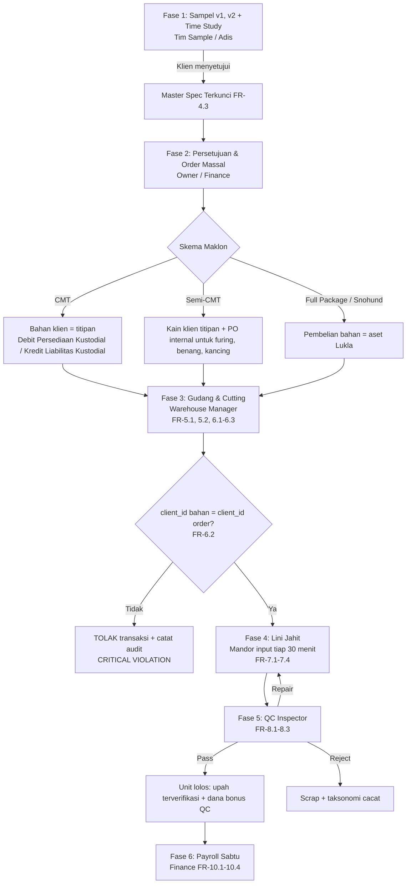

```mermaid
flowchart TD
    P1["Fase 1: Sampel v1, v2 + Time Study<br/>Tim Sample / Adis"] -->|"Klien menyetujui"| MS["Master Spec Terkunci FR-4.3"]
    MS --> P2["Fase 2: Persetujuan & Order Massal<br/>Owner / Finance"]
    P2 --> SCH{"Skema Maklon"}
    SCH -->|"CMT"| CM["Bahan klien = titipan<br/>Debit Persediaan Kustodial / Kredit Liabilitas Kustodial"]
    SCH -->|"Semi-CMT"| SM["Kain klien titipan + PO internal untuk furing, benang, kancing"]
    SCH -->|"Full Package / Snohund"| FP["Pembelian bahan = aset Lukla"]
    CM --> P3
    SM --> P3
    FP --> P3
    P3["Fase 3: Gudang & Cutting<br/>Warehouse Manager<br/>FR-5.1, 5.2, 6.1-6.3"] --> CHK{"client_id bahan = client_id order?<br/>FR-6.2"}
    CHK -->|"Tidak"| BLK["TOLAK transaksi + catat audit<br/>CRITICAL VIOLATION"]
    CHK -->|"Ya"| P4["Fase 4: Lini Jahit<br/>Mandor input tiap 30 menit<br/>FR-7.1-7.4"]
    P4 --> P5["Fase 5: QC Inspector<br/>FR-8.1-8.3"]
    P5 -->|"Pass"| PASS["Unit lolos: upah terverifikasi + dana bonus QC"]
    P5 -->|"Repair"| P4
    P5 -->|"Reject"| SCRAP["Scrap + taksonomi cacat"]
    PASS --> P6["Fase 6: Payroll Sabtu<br/>Finance FR-10.1-10.4"]
```